# Stock Monitor

Stock Monitor 是一个跨平台行情桌面应用，用 Electron + React + MobX MVVM 实现远端行情查询、多源切换、当日分时、K 线展示、自选股管理、历史 K 线缓存、K 线历史回测和做T盈亏测算。

当前默认进入分时视图，默认分时数据源为东方财富；K 线数据源和分时数据源已经拆分保存，用户可以分别在对应视图下切换东方财富、腾讯/QQ 财经、新浪财经、网易财经 163 的可用能力，并可在应用内检测数据源状态、配置网络代理、管理图表指标、维护本地自选股、刷新历史 K 线缓存、比较候选策略历史表现和估算做T盈亏。

## 免责声明

本项目仅用于个人学习、技术研究和行情展示验证，不构成任何投资建议、交易建议、荐股服务或收益承诺。应用内行情数据来自公开网页接口或第三方服务，可能存在延迟、缺失、错误、接口变更、访问受限或服务不可用等情况；所有技术指标、B/S 信号、策略回测和做T测算仅为程序化计算或历史估算结果，不保证准确性、完整性或适用于任何交易决策。用户应自行核验数据并独立承担投资和使用风险。

## 技术栈

- 桌面框架：`Electron`
- 构建工具：`electron-vite`
- 前端框架：`React + TypeScript`
- MVVM 状态：`MobX + mobx-react-lite`
- UI 框架：`Ant Design`
- K 线图表：`klinecharts`
- 分时图表：`Canvas`
- 文本编码：`iconv-lite`
- 本地配置：`electron-store`
- 日志：`electron-log`
- 自动更新：`electron-updater`
- 测试：`Vitest`
- 打包：`electron-builder`
- 包管理器：`yarn`

## 快速启动

```bash
# 从项目父目录进入
cd StockMonitor
yarn install
yarn dev
```

如果 Electron 二进制没有下载完整，可以先执行：

```bash
ELECTRON_MIRROR=https://npmmirror.com/mirrors/electron/ node node_modules/electron/install.js
yarn dev
```

启动后会默认加载：

```ts
{
  viewMode: 'timeshare',
  timeshareSourceId: 'eastmoney',
  query: {
    sourceId: 'eastmoney',
    symbol: 'sh000001',
    period: 'day',
    adjust: 'qfq',
    startDate: 'YYYYMMDD', // 启动日往前 2 年
    endDate: 'YYYYMMDD' // 启动日
  },
  indicatorSettings: createDefaultIndicatorSettings(), // K 线：BOLL、VOL、B/S 默认开启，策略信号默认关闭
  timeshareIndicatorSettings: createDefaultTimeshareIndicatorSettings(), // 分时：基础显示默认开启，新增指标默认关闭
  klineStrategySettings: createDefaultKlineStrategySettings(),
  watchlist: []
}
```

## 常用命令

```bash
yarn dev         # 启动开发模式
yarn test        # 运行单元测试
yarn typecheck   # 运行 TypeScript 类型检查
yarn build       # 生产构建
yarn dist        # 构建安装包
```

## 功能范围

- 视图：默认分时，可切换到 K 线；顶部切换顺序为“分时 / K线”
- 数据源：东方财富、腾讯/QQ 财经、新浪财经、网易财经 163
- 市场范围：沪深京股票、ETF、指数
- 默认查询：分时视图、东方财富分时源、`sh000001`；K 线保留东方财富、日线、前复权、近 2 年
- 数据源拆分：K 线使用 `workspace.query.sourceId`，分时使用 `workspace.timeshareSourceId`，两者共享证券代码但互不覆盖
- 分时：价格线、均价线、昨收参考线、右侧涨跌幅轴、成交量柱、主图/成交量/副图指标、B/S 信号、分区图例、十字线、tooltip，并压缩午间休市空档
- 分时刷新：分时视图在窗口可见且处于 A 股交易时段时每 15 秒自动静默刷新；K 线仍由用户手动刷新
- 首次加载：K 线首次加载支持跨源 fallback；分时不做跨源自动 fallback，东方财富分时会在同一数据源内从 `push2.eastmoney.com` fallback 到 `push2delay.eastmoney.com`
- 数据源管理：弹窗按当前视图测试数据源请求状态、耗时和返回记录数，并展示分时能力；分时视图只允许切换到支持分时的数据源
- 自选股：顶部 `自选` 入口打开左侧自选股栏，支持单只/批量添加、剪切板粘贴、按名称或代码搜索筛选、管理模式删除所选、点击切换和本地持久化
- K 线缓存：自选股栏 `缓存` 入口打开历史 K 线缓存弹窗，默认单只股票缓存且只勾选日线/前复权；可切换多只股票缓存后按自选股列表批量查看完整性、刷新、取消任务和清理选中缓存
- K 线历史回测：顶部 `策略` 入口打开回测面板，支持日线/周线/月线下比较均线交叉、突破回撤、RSI 超买超卖、MACD 趋势确认以及均线多头排列、N 日新高突破、放量突破、布林带突破、布林带均值回归、KDJ 超卖反弹、ATR 趋势跟踪、缩量回踩均线等候选策略
- 做T盈亏测算：顶部 `做T` 入口打开右侧测算 Drawer，支持费用明细、ETF 免印花税、多笔记录、总盈亏和本地持久化
- 周期：日线、周线、月线、5/15/30/60 分钟
- 复权：不复权、前复权、后复权；不支持复权的数据源会自动收敛到不复权
- K 线主图：K 线、BOLL、MA、EMA、B/S 信号、策略信号；`B/S` 默认开启，`策略` 默认关闭，两者互斥
- K 线副图：成交量、VOL、MACD、KDJ、RSI，最多同时开启 3 个副图指标
- 分时主图：价格线、均价线、昨收线、MA、EMA、BOLL、B/S 信号
- 分时成交量区：成交量柱、VOL MA
- 分时副图：MACD、RSI，最多同时开启 2 个副图指标
- 交互：缩放、拖拽、十字线、tooltip
- 顶部工具栏：证券代码、自选、分时/K线、周期、复权、日期范围、刷新、数据源、代理、做T、指标、检查更新、启动检查更新开关；分时视图隐藏 K 线专属控件
- 帮助菜单：使用说明书、版本更新说明、检查更新、关于 Stock Monitor
- 状态栏：当前视图的数据源、证券代码、记录数或分时点数、最新行情、加载状态、更新状态
- 本地持久化：查询条件、指标开关与参数、策略偏好、网络代理、启动检查更新配置会保存到 `electron-store`；历史 K 线缓存保存到本地应用数据目录

## 界面截图

### 分时视图

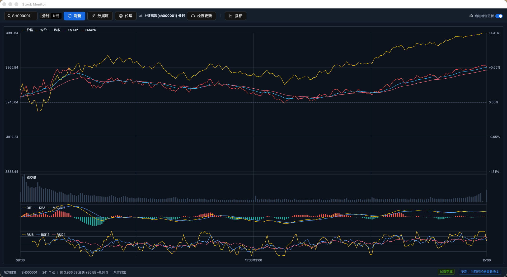

分时首页展示当日分时价格线、均价线、昨收线、分时指标图例、成交量区、MACD/RSI 副图区、底部状态栏和自动刷新状态。

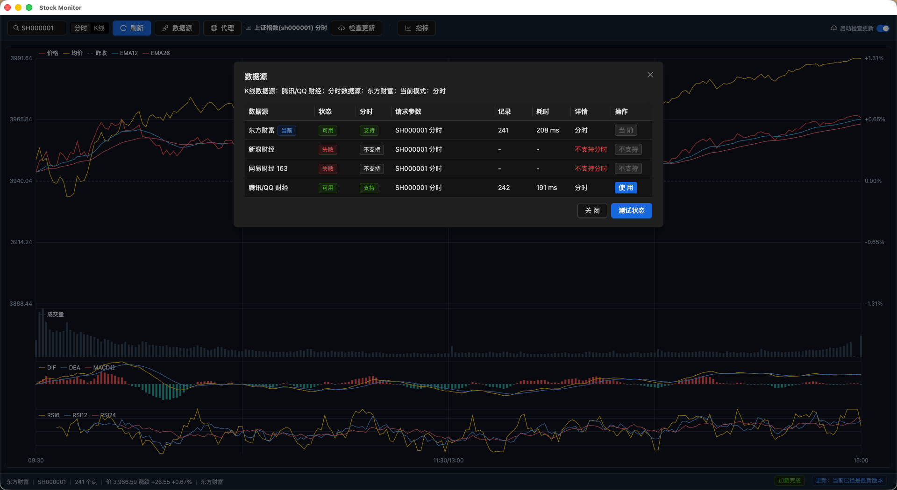

分时数据源弹窗按当前分时模式测试各数据源，展示分时能力、请求状态、耗时、记录数，并限制不支持分时的数据源被误用。

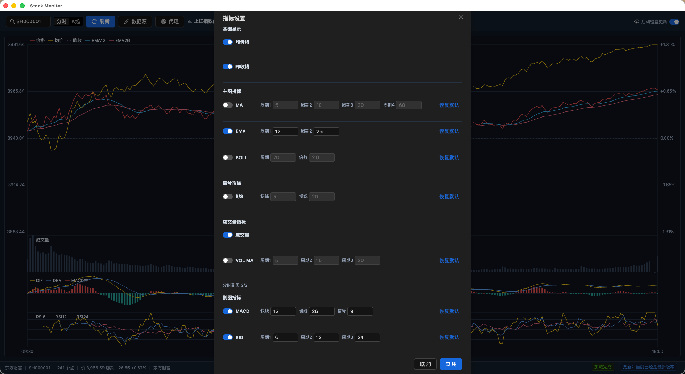

分时指标弹窗按基础显示、主图指标、信号指标、成交量指标和副图指标分组，支持分时 MA/EMA/BOLL、B/S、VOL MA、MACD、RSI 的开关和参数配置。

### 网络代理

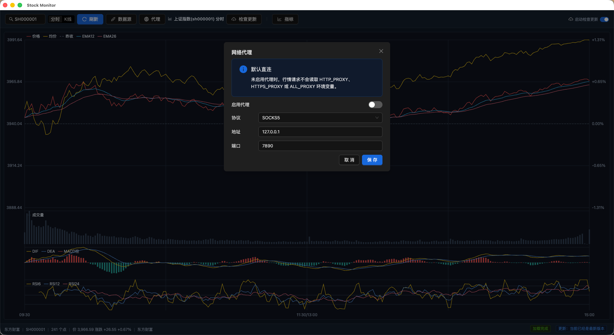

网络代理弹窗默认直连，不读取系统代理环境变量；需要代理时可手动启用 SOCKS5 或 HTTP，并配置地址和端口。

### K 线视图

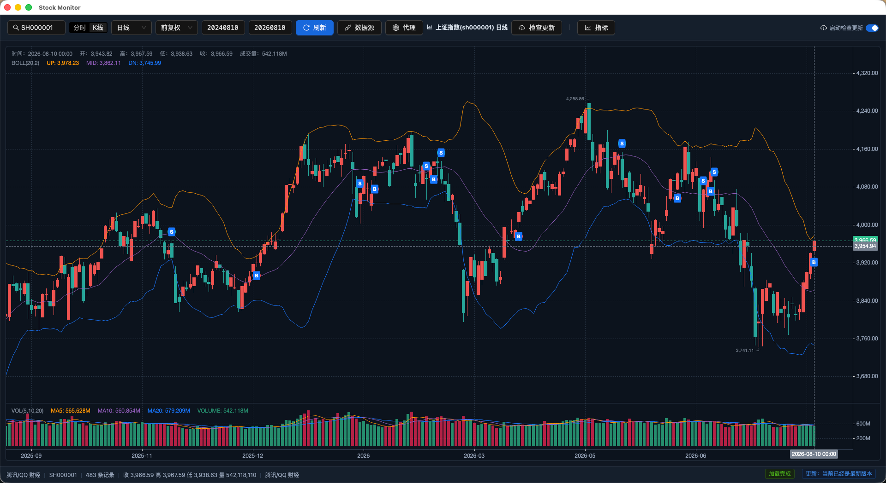

K 线首页展示周期、复权和日期范围控制，主图支持 BOLL、MA、EMA、B/S 标记和选中策略信号标记，副图区展示成交量和相关指标。

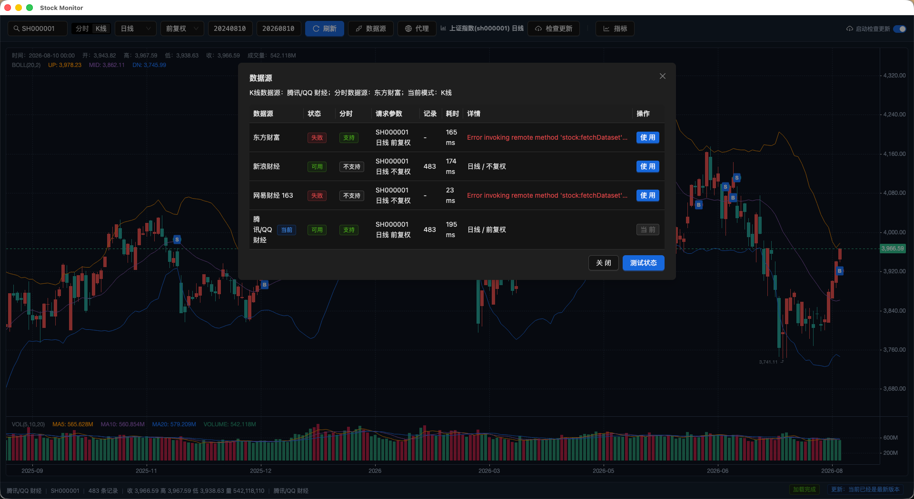

K 线数据源弹窗按当前 K 线查询参数测试各数据源，展示周期、复权、分时能力、请求状态、错误详情和切换操作。

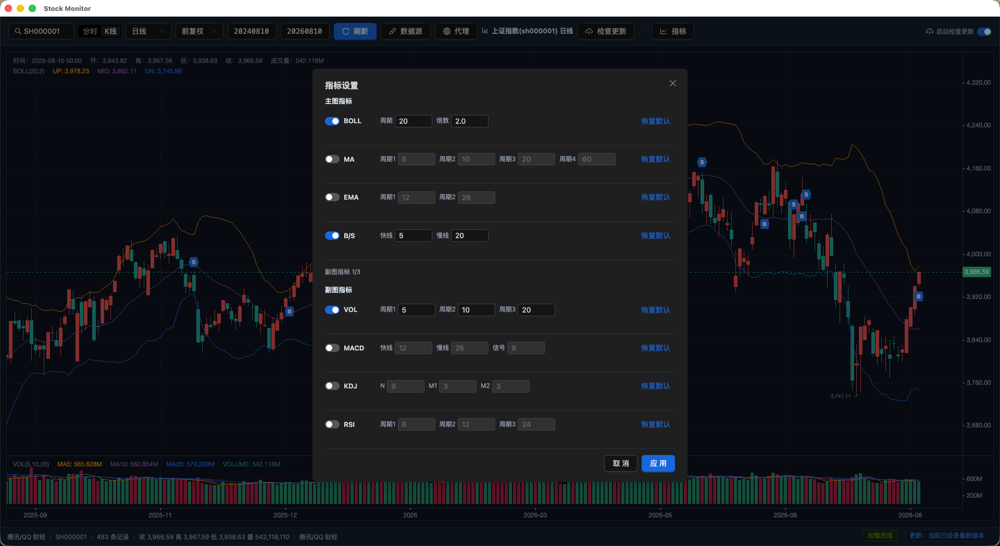

K 线指标弹窗管理 BOLL、MA、EMA、B/S、策略、VOL、MACD、KDJ、RSI 的开关和参数，并限制副图指标数量；`B/S` 与 `策略` 信号开关互斥。

### 自选股、缓存和回测

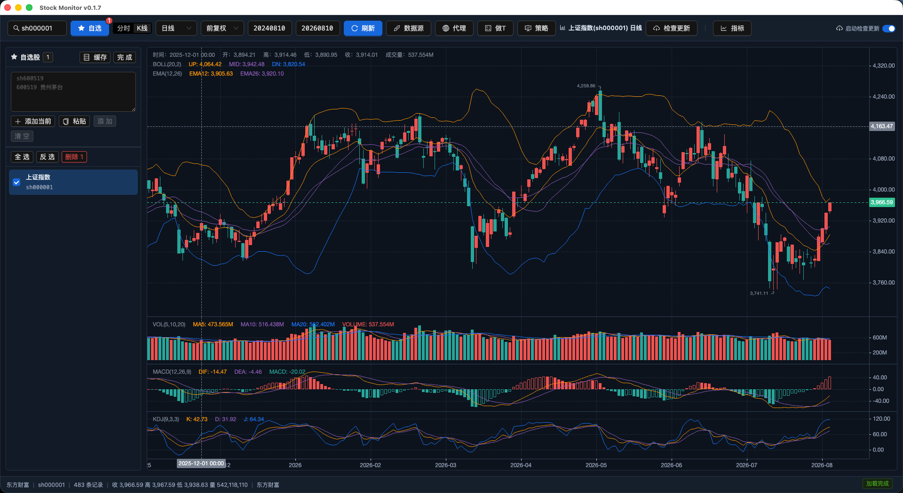

自选股栏支持单只添加、批量粘贴、按名称或代码搜索筛选、管理模式删除所选和点击切换证券；K 线模式下还可以从自选股栏进入历史 K 线缓存管理。

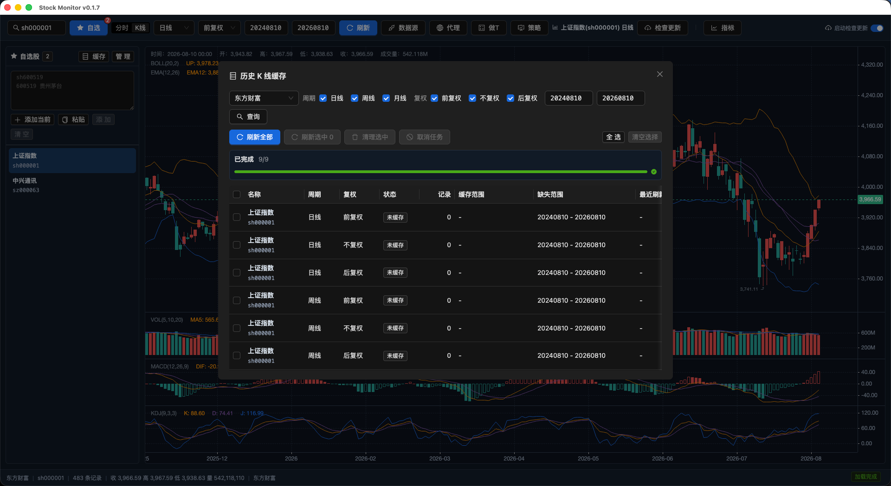

历史 K 线缓存弹窗默认使用单只股票缓存，每次打开都只针对当前证券且不记忆上次模式；默认只勾选日线和前复权。用户可切换到多只股票缓存后按当前自选股列表展开组合。列表展示每行对应数据源、缓存状态、记录数、缓存范围、缺失范围和任务进度，并支持刷新全部、刷新选中、清理选中和取消任务。

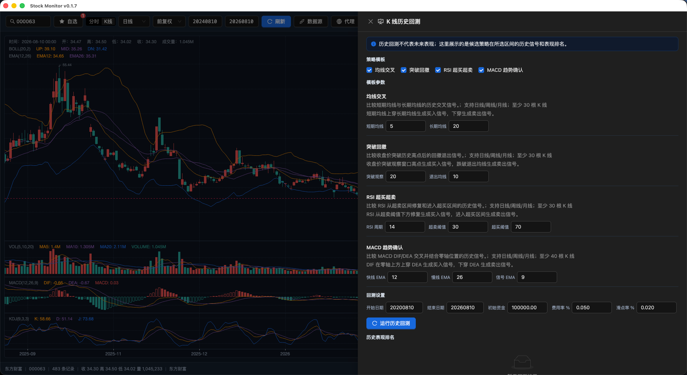

K 线历史回测面板用于比较候选策略在顶部 K 线日期范围内的程序化信号和历史表现排名；策略模板会展示类型、基本逻辑和推荐程度，推荐程度只是模板元数据，不替代历史回测评分。如需在图表展示选中策略信号，需要在 K 线指标中开启 `策略`，开启后会关闭 `B/S`。历史回测不代表未来表现，也不构成买卖建议或收益承诺。

### 做T盈亏测算

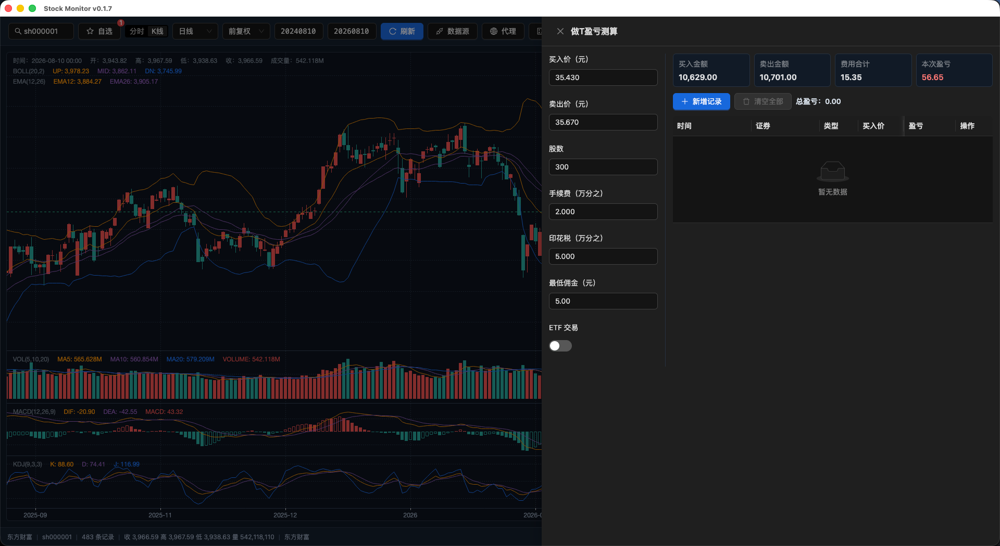

做T盈亏测算 Drawer 基于用户输入的买入价、卖出价、股数、手续费、印花税和最低佣金估算费用明细、本次盈亏和多笔记录汇总；测算结果不代表真实成交结果。

## 数据源能力

| 数据源 | K 线周期 | 复权 | 市场 | 分时 | 备注 |
|---|---|---|---|---|---|
| 东方财富 | 日/周/月/5/15/30/60 分钟 | 不复权/前复权/后复权 | 股票/ETF/指数 | 支持 | 默认主源；分时主机支持 `push2` -> `push2delay` 同源 fallback |
| 腾讯/QQ 财经 | 日/周/月 | 不复权/前复权/后复权 | 股票/ETF/指数 | 支持 | K 线和分时备用源 |
| 新浪财经 | 日/周/月/5/15/30/60 分钟 | 不复权 | 股票/ETF/指数 | 不支持 | 可作为 K 线分钟线备用源 |
| 网易财经 163 | 日线 | 不复权 | 股票 | 不支持 | 当前只作为 K 线日线股票备用源 |

免费网页接口不提供稳定 SLA。每个源都封装在 main process 的数据源 adapter 里，K 线和分时分别归一化为 `StockDataset`、`StockTimeshareDataset`，后续替换正式数据服务时不需要改图表和指标层。

## 分时数据

- 东方财富分时使用 `trends2/get` 接口，启动失败场景下会保留当前分时源，只在东方财富内部切换延迟主机重试。
- 腾讯/QQ 财经分时使用 minute query 接口，按累积成交量和成交额换算单分钟增量，并读取昨收用于涨跌幅轴。
- 新浪财经当前没有接入标准分时源；其 1 分钟 K 线接口可作为后续降级分时方案评估。
- 网易财经 163 当前没有接入分时能力。
- 分时自动刷新只按工作日交易时间判断，暂未接入节假日交易日历。

## 架构说明

项目采用 Electron 三端结构：

```text
Electron Main
  ├─ 窗口、菜单
  ├─ 远端 K 线/分时数据源 clients
  ├─ 数据源注册表
  ├─ 本地配置、网络代理、日志
  ├─ 自动更新
  └─ IPC handlers

Preload
  └─ window.stockApi typed bridge

Renderer
  ├─ View: React + Ant Design
  ├─ ViewModel: MobX class
  ├─ Model: K 线/分时行情数据、指标计算
  └─ Adapter: Electron 数据桥、klinecharts、Canvas 分时图、自动更新状态
```

MVVM 约束：

- View 只负责展示和触发命令。
- ViewModel 负责状态、查询条件和流程编排。
- Model 负责纯业务逻辑，例如指标计算和行情类型。
- Adapter 负责外部依赖，例如 Electron IPC、远端行情源、klinecharts。
- Renderer 不直接访问远端行情接口，只通过 preload 暴露的 `window.stockApi`，其中 K 线和分时分别走 `fetchStockDataset`、`fetchStockTimeshareDataset`。

## 目录结构

```text
src/
  main/
    index.ts                  # Electron 主入口
    ipc.ts                    # IPC handlers
    menu.ts                   # 中文应用菜单
    remote-stock-sources.ts   # 远端行情源注册表和数据归一化
    store.ts                  # electron-store 配置
    logger.ts                 # electron-log
    update-manager.ts         # electron-updater

  preload/
    index.ts                  # contextBridge 注入
    stock-api.ts              # preload 类型定义

  renderer/
    app/
      App.tsx
      RootViewModel.ts

    features/
      stock-workspace/
        models/               # K 线/分时类型、指标定义、指标计算
        view-models/          # MobX ViewModel、K 线和分时图状态
        adapters/             # Electron 数据桥、klinecharts 和 Canvas 分时图适配
        views/                # React + Ant Design 界面、K 线和分时图视图

      trade-profit-calculator/
        models/               # 做T费用和盈亏测算规则
        view-models/          # MobX 测算状态、记录和持久化
        adapters/             # Electron 设置桥
        views/                # 做T测算 Drawer

      app-update/
        models/
        view-models/
        views/

tests/
  remote-stock-sources.test.ts
  indicator-definitions.test.ts
  indicator-engine.test.ts
  timeshare-indicator-definitions.test.ts
  timeshare-indicator-engine.test.ts
  legacy-stock-parser.test.ts
  stock-workspace-view-model.test.ts
  klinecharts-adapter.test.ts
  timeshare-chart.test.ts
```

## 查询与工作区设置

K 线查询使用 `StockQuery`：

```ts
interface StockQuery {
  sourceId: 'eastmoney' | 'sina' | 'netease163' | 'tencent'
  symbol: string
  period: 'day' | 'week' | 'month' | '5' | '15' | '30' | '60'
  adjust: 'none' | 'qfq' | 'hfq'
  startDate: string
  endDate: string
}
```

分时查询使用独立的 `StockTimeshareQuery`：

```ts
interface StockTimeshareQuery {
  sourceId: 'eastmoney' | 'sina' | 'netease163' | 'tencent'
  symbol: string
  tradeDate?: string
}
```

工作区配置会同时保存当前视图和两类数据源：

```ts
interface WorkspaceSettings {
  viewMode?: 'kline' | 'timeshare'
  timeshareSourceId?: StockQuery['sourceId']
  query: StockQuery
  indicatorSettings?: IndicatorSettingsMap
  timeshareIndicatorSettings?: TimeshareIndicatorSettingsMap
  klineStrategySettings?: KlineStrategySettings
  watchlist?: WatchlistItem[]
  enabledIndicators?: Partial<Record<IndicatorName, boolean>>
}
```

证券代码支持 `sh/sz/bj` 前缀，例如 `sh000001`、`sz399001`、`sh600519`、`sz159915`。不带前缀时会按代码段推断市场；指数代码建议显式输入前缀，避免 `000001` 同时代表上证指数和平安银行。

K 线数据源返回后会归一化为 `StockDataset`，再进入 `enrichStockDataset` 计算指标并渲染图表。分时数据源返回后会归一化为 `StockTimeshareDataset`，再进入 `enrichTimeshareDataset` 计算分时指标，并由分时 ViewModel 和 Canvas adapter 渲染。

切换 K 线数据源、周期或复权时，ViewModel 会按当前数据源能力自动收敛不支持的选项。例如新浪财经不支持复权，会自动改为不复权；网易财经 163 只支持日线股票。切换分时数据源时，ViewModel 会拒绝新浪财经、网易财经 163 这类未声明分时能力的数据源，避免把 K 线源误用成分时源。

## 指标说明

K 线和分时使用独立指标配置。K 线配置保存在 `workspace.indicatorSettings`，分时配置保存在 `workspace.timeshareIndicatorSettings`，两者互不覆盖。

### K 线指标

默认开启：

- `BOLL`：20 周期、2 倍标准差
- `VOL`：成交量与 MA5、MA10、MA20
- `B/S`：快线 5、慢线 20，基于典型价格 `(close + high + low) / 3` 的 EMA 交叉信号

可选指标：

- 主图：`MA` 默认 5/10/20/60，`EMA` 默认 12/26
- 副图：`MACD` 默认 12/26/9，`KDJ` 默认 9/3/3，`RSI` 默认 6/12/24
- overlay 信号：`策略` 默认关闭，用于显示当前选中策略回测结果的买入/卖出标记

指标设置：

- 指标弹窗支持开关、参数调整和恢复默认参数。
- 副图指标最多同时开启 3 个。
- 参数会校验范围，部分指标要求周期不能重复，`MACD` 要求快线小于慢线。
- 指标开关和参数会随工作区设置持久化，并兼容旧版 `enabledIndicators` 配置。

指标开关行为：

- 关闭 `BOLL` 只隐藏 BOLL，不影响 K 线。
- 关闭 `VOL` 会移除成交量指标面板。
- 关闭 `B/S` 删除所有 B/S 标记，不影响 K 线。
- 开启 `策略` 会关闭 `B/S`；开启 `B/S` 会关闭 `策略`。默认保留 `B/S` 开启、`策略` 关闭，避免图表同时出现两套买入/卖出标记。
- 重复切换不会累加重复指标或重复标记。

本地 model 会为数据集计算 `BOLL`、`VOL MA` 和 `B/S` 信号；图表层通过 `klinecharts` 创建 `BOLL`、`VOL`、`MA`、`EMA`、`MACD`、`KDJ`、`RSI` 指标，并使用自定义 overlay 渲染 `B/S` 标记和已开启的选中策略信号标记。

### 分时指标

默认开启：

- `价格线`：固定展示，不提供关闭
- `均价线`：数据源返回的分时均价，可关闭
- `昨收线`：基于 `previousClose` 的参考线，可关闭
- `成交量`：单分钟成交量柱，可关闭

默认关闭：

- 主图：`MA` 默认 5/10/20/60，`EMA` 默认 12/26，`BOLL` 默认 20/2
- 信号：`B/S` 默认 5/20，基于分时价格快慢 EMA 交叉；上穿生成 `B`，下穿生成 `S`
- 成交量区：`VOL MA` 默认 5/10/20
- 副图：`MACD` 默认 12/26/9，`RSI` 默认 6/12/24，最多同时开启 2 个副图指标

分时指标设置：

- 分时指标弹窗分为基础显示、主图指标、信号指标、成交量指标和副图指标。
- 参数会校验范围，周期类参数为 `1-250` 整数；`B/S` 和 `MACD` 要求快线小于慢线。
- 分时自动刷新或指标参数应用后会在本地重新计算指标，不额外请求行情。
- 分时图按区域展示图例：主图显示价格、均价、昨收、MA、EMA、BOLL、B/S；成交量区显示成交量和 VOL MA；副图区显示 MACD/RSI。
- tooltip 会按鼠标所在区域展示相关指标值；命中 B/S 信号点时显示 `B/S 买入` 或 `B/S 卖出`。

## 做T盈亏测算

顶部工具栏 `做T` 按钮会打开右侧测算 Drawer，用于基于用户输入估算买入卖出组合的费用明细和盈亏。

首版能力：

- 输入买入价、卖出价、股数、手续费万分比、印花税万分比、最低佣金和 ETF 标记。
- 实时展示买入金额、卖出金额、费用合计和本次盈亏。
- 新增多笔测算记录，按记录汇总总盈亏。
- 单条删除或清空全部测算记录。
- 草稿输入和最近 200 条测算记录保存到本地设置，应用重启后恢复。

费用规则：

- 买入手续费和卖出手续费分别按 `max(成交金额 * 手续费万分比 / 10000, 最低佣金)` 计算。
- 普通股票印花税按 `卖出金额 * 印花税万分比 / 10000` 计算。
- ETF 交易不扣印花税。
- 盈亏为 `卖出金额 - 买入金额 - 买入手续费 - 卖出手续费 - 印花税`。

做T盈亏测算只基于输入参数进行费用和盈亏计算，不代表真实成交结果，也不构成投资建议或收益承诺。

## 自选股与 K 线缓存

顶部工具栏 `自选` 按钮会打开左侧自选股栏。自选股列表保存到本地设置，支持：

- 单只添加当前证券。
- 批量粘贴证券代码和名称。
- 按股票名称、完整代码或裸代码搜索筛选；搜索词不保存，关闭自选股栏后会清空。
- 管理模式下选择、全选、反选和删除所选。
- 点击自选股切换当前证券，并按当前视图刷新行情。

在自选股栏点击 `缓存` 会打开历史 K 线缓存弹窗。缓存管理用于提前准备当前证券或自选股历史 K 线数据，主要能力包括：

- 默认使用 `单只股票缓存`，每次打开弹窗都只针对当前证券，不记忆上次缓存模式；当前证券不在自选股列表中也可以缓存。
- 默认只勾选 `日线` 和 `前复权`，`周线`、`月线`、`不复权`、`后复权` 需要手动勾选。
- 可切换 `多只股票缓存`，按当前自选股列表批量查询缓存完整性；自选股为空时不会提交批量刷新任务。
- 按 `证券 × 数据源 × 周期 × 复权` 展开状态行，展示每行数据源、记录数、缓存范围、缺失范围和最近刷新时间。
- 手动刷新全部组合或刷新选中组合，任务运行时展示进度并支持取消剩余任务；`刷新全部` 在单只模式只刷新当前证券，在多只模式刷新当前自选股列表。
- 清理选中组合的缓存数据；清理缓存不会删除自选股，也不会改变当前图表数据。

K 线缓存保存到本地应用数据目录，免费网页接口仍可能因为网络、代理、访问限制或接口变更导致刷新失败。

## K 线历史回测

顶部工具栏 `策略` 按钮会打开 K 线历史回测面板，用于比较候选策略在顶部 K 线日期范围内的程序化信号和历史表现。

第一版能力：

- 支持日线、周线和月线；暂不支持 5/15/30/60 分钟 K 线回测。
- 内置均线交叉、突破回撤、RSI 超买超卖、MACD 趋势确认，以及均线多头排列、N 日新高突破、放量突破、布林带突破、布林带均值回归、KDJ 超卖反弹、ATR 趋势跟踪、缩量回踩均线等候选策略模板。
- 策略模板展示类型、基本逻辑和推荐程度；推荐程度只作为模板元数据参考，历史表现排名仍由回测评分决定。
- 回测日期范围使用顶部 K 线日期范围；策略面板不再单独设置开始日期或结束日期。
- 支持设置初始资金、费用率和滑点率。
- 优先读取本地历史 K 线缓存；缓存缺失或不完整时，会通过既有缓存刷新链路准备数据。
- 展示历史表现排名、收益和回撤指标、交易明细、信号列表、回测区间、实际数据区间和回测假设。
- 选中策略后，只有在 K 线指标中开启 `策略` 开关时，图表才会展示该策略的历史买入/卖出信号标记；`策略` 与 `B/S` 互斥。

历史回测只展示候选策略在所选区间的历史表现和程序化信号，不代表未来表现，不构成投资建议、买卖建议、荐股服务或收益承诺。

## 本地设置与代理

本地设置通过 `electron-store` 保存，配置名为 `stock-monitor`。当前保存内容包括：

- `checkUpdatesOnStartup`：是否在启动后检查更新
- `networkProxy`：代理开关、协议、地址、端口
- `workspace.viewMode`：当前视图，默认 `timeshare`
- `workspace.timeshareSourceId`：分时数据源，默认 `eastmoney`
- `workspace.query`：K 线数据源、证券代码、周期、复权和日期范围
- `workspace.indicatorSettings`：K 线指标开关和参数
- `workspace.timeshareIndicatorSettings`：分时指标开关和参数
- `workspace.klineStrategySettings`：K 线策略模板选择、参数和回测假设；回测区间来自 `workspace.query` 的 K 线日期范围
- `workspace.watchlist`：本地自选股列表，包含证券代码、名称和创建时间
- `tradeProfit.draft`：做T测算草稿输入
- `tradeProfit.records`：最近 200 条做T测算记录

网络代理默认关闭，关闭时行情请求不读取 `HTTP_PROXY`、`HTTPS_PROXY` 或 `ALL_PROXY` 环境变量。代理支持 `SOCKS5` 和 `HTTP`，默认草稿配置为 `127.0.0.1:7890`。

## 应用内帮助

帮助菜单提供以下入口：

- `帮助 -> 使用说明书`：在当前窗口内打开离线说明书，覆盖快速开始、证券代码、分时、K 线、指标、自选股、K 线缓存、策略回测、做T测算、数据源、网络代理、应用更新和常见问题。
- `帮助 -> 版本更新说明`：在当前窗口内查看当前安装包内置的版本更新记录，内容来自 `CHANGELOG.md`。
- `帮助 -> 检查更新`：手动触发应用更新检查。
- `帮助 -> 关于 Stock Monitor`：查看当前应用版本。

## 自动更新

自动更新使用 `electron-updater`。

默认策略：

- 发布源：GitHub Releases
- 发布地址：`https://github.com/woodwen/StockMonitor/releases`
- 更新元数据：由 `electron-builder` 随桌面安装包生成，并作为 Release assets 上传
- macOS 自动更新需要同时上传 `dmg` 和 `zip`，其中 `zip` 供 `electron-updater` 安装更新使用
- 启动后延迟 5 秒检查更新
- 菜单入口：`帮助 -> 检查更新`
- 工具栏入口：`检查更新`
- 工具栏开关：控制是否启动后检查更新
- 有新版本时提示下载
- 下载完成后提示重启安装
- 开发环境不真实更新，只走日志和状态流
- macOS 构建在完成 Developer ID 签名和 notarization 前不执行应用内自动安装；检查到新版本时打开 GitHub Release 下载页，由用户手动下载 DMG 安装

`package.json` 的 `build.publish` 已配置为 GitHub provider：`woodwen/StockMonitor`，正式发布时仍需准备 macOS/Windows 签名。

## 打包

`package.json` 中已配置：

- macOS：`dmg` + `zip`，`zip` 用于自动更新
- Windows：`nsis`
- Linux：`AppImage`
- 应用 ID：`com.stockmonitor.desktop`
- 产品名：`Stock Monitor`

执行：

```bash
yarn dist
```

## 验证

提交前建议运行：

```bash
yarn test
yarn typecheck
yarn build
```

当前测试覆盖：

- 远端数据源元信息、K 线/分时请求归一化、能力校验和网络错误透传
- 东方财富分时解析、分时同源主机 fallback、腾讯/QQ 财经分时解析、未支持分时源拦截
- 旧版行情文件解析
- K 线指标定义、参数校验、旧配置迁移、副图指标数量限制
- K 线指标计算
- 分时指标定义、参数校验、副图指标数量限制
- 分时指标计算，包括 MA、EMA、BOLL、VOL MA、MACD、RSI 和 B/S 信号
- StockWorkspace ViewModel 远端查询、K 线启动 fallback、默认分时启动、分时/K 线源独立、数据源测试、配置持久化、代理保存
- 自选股管理、K 线缓存状态、批量刷新、读取缓存 dataset、清理缓存和异常隔离
- K 线策略模板、参数校验、历史信号生成、交易撮合、收益/回撤指标、策略排名、策略信号开关和 ViewModel 回测编排
- 做T盈亏测算 model、持久化设置清洗和 ViewModel 记录管理
- TimeshareChart ViewModel 分时摘要、点数和 revision 更新
- klinecharts Adapter 指标开关、参数变更、B/S overlay 和策略 overlay 不重复累加
- Canvas Timeshare Adapter 午间休市压缩、分时指标图例、tooltip、B/S 标记和动态副图区

## 设计取舍

- 远端请求统一放在 Electron main process，renderer 只通过 typed preload bridge 调用。
- 多源差异集中在 `remote-stock-sources.ts`，图表和指标层只接收统一后的 `StockDataset` 或 `StockTimeshareDataset`。
- K 线和分时数据源拆开保存，避免某个平台只支持其中一种行情时污染另一种视图的选择。
- K 线只在首次加载时做有限跨源 fallback；分时不做跨源自动 fallback，日常切源由用户在数据源弹窗里手动完成，避免不同数据源结果不一致时难以排查。
- K 线缓存只按明确的 `sourceId + symbol + period + adjust` 维度复用，不混用不同数据源、周期或复权口径的数据。
- 策略回测优先使用本地历史 K 线缓存作为输入，避免 renderer 直接请求远端行情接口，也避免用当前图表数据绕过缓存完整性校验。
- 代理默认直连且不隐式读取环境变量，避免开发机代理配置污染行情请求结果。
- 分时指标与 K 线指标配置拆开保存，避免两种图表不同数据结构和展示密度互相影响。
- 分时当前没有分钟 OHLC、流通股本、盘口或逐笔方向数据，因此暂不实现 KDJ、量比、换手率、委比、内外盘和资金流等需要额外数据口径的指标。

## 致谢

感谢东方财富、腾讯/QQ 财经、新浪财经、网易财经 163 等公开免费行情数据源为个人学习和技术研究提供参考数据。本项目仅做数据聚合、归一化和本地展示，不隶属于上述数据源，也不对其接口稳定性、数据准确性或可用性作任何承诺。
